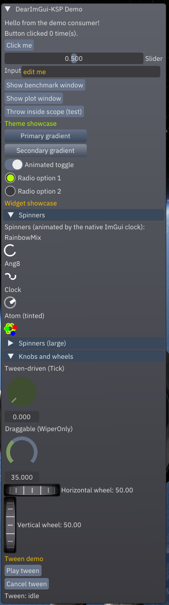
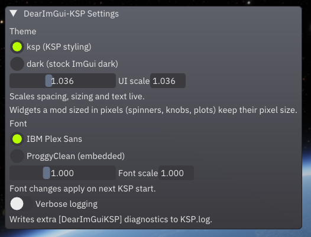
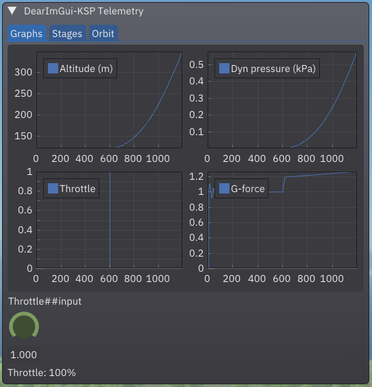
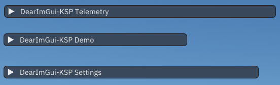

# DearImGui-KSP

DearImGui-KSP brings [Dear ImGui](https://github.com/ocornut/imgui) to KSP,
providing a shared library anyone can use.  A UI framework for KSP mods,
providing: collapsible windows, buttons, sliders, text, and also live 
plots and graphs, dials and knobs, toggles, and animated spinners.  
Everything is rendered on the GPU and the performance impact is minimal
even for large UI's that update every frame.

**Status: 1.3.0** (2026-09-12). KSP 1.12.x, Windows
x64, D3D11 or OpenGL. Windows can now be docked to each other, enabled by 
default with toggle in the settings panel. New in 1.3.0: horizontal row
layout (`ImGuiEx.Row`), combo dropdowns, and hover tooltips.

## Screenshots

<table>
  <tr>
    <!-- Left Column: The Tall Panel -->
    <td rowspan="3" valign="top">
    <strong>Demo Panel</strong><br>
      
    </td>
    <!-- Right Column: Settings Window (Top) -->
    <td valign="top">
    <strong>Settings Panel</strong><br>
      
    </td>
  </tr>
  <tr>
    <!-- Right Column: Telemetry Graphs (Middle) -->
    <td valign="top">
    <strong>Telemetry Plot Demo</strong><br>
      
    </td>
  </tr>
  <tr>
    <!-- Right Column: Collapsed Windows (Bottom) -->
    <td valign="top">
    <strong>Collapsed Windows</strong><br>
      
    </td>
  </tr>
</table>

## Why should I use this?

If the stock Unity IMGUI gives you everything you need at a performance
cost you can't notice, then switching your UI doesn't gain you
very much. DearImGui-KSP means an extra dependency, and it means learning
how to work with it.

DearImGui-KSP has real value when the stock IMGUI falls short:

- Your UI has so many fields, buttons, or readouts that IMGUI bogs the
  framerate down. DearImGui-KSP renders on the GPU; its measured
  managed-side frame cost stays a fraction of a millisecond even with
  busy dashboards open.
- You want live plots and graphs of flight data, not just text fields.
- You want animated elements without having to hand-roll them.
- You want features like collapsible sections and windows, automatic
  UI window sizing, user-controllable UI rescaling, all handled natively by
  DearImGui-KSP

## For players

You only need this if a mod you use lists DearImGui-KSP as a dependency.
Extract `DearImGuiKSP-x.y.z.zip` into your KSP root so `GameData\DearImGuiKSP\`
ends up as the install path. Once installed, the mod adds a toolbar button 
where you can pick the theme and font and adjust UI and font scaling
(Font and Font Scale require a restart of KSP to take effect).

The optional demo mod (`DearImGuiKSPDemo-x.y.z.zip`, a separate install)
shows many examples of what the framework can do.  It includes some spinners,
a variety of widgets, plot examples, etc.  Players should skip it.

## For modders

Your mod hard-depends on DearImGui-KSP and draws its UI through a 
C# API - declare `[assembly: KSPAssemblyDependencyEqualMajor("DearImGuiKSP",
1, 0)]`, register a frame callback, and call the facade. Full modder
documentation ships in [`docs/`](docs/) (and as plain files inside the
release zip), starting with
[00-getting-started](docs/00-getting-started.md).

On versioning: patch (1.0.**x**) and minor (1.**x**.0) updates never break
consumers. Only a major bump (**x**.0.0) signals breaking API changes and
requires you to update your dependency attribute and those will be rare.

## How it works

- `DearImGuiKSPNative.dll` (C++) - Dear ImGui 1.92.9 + cimgui compiled
  directly in, with D3D11 and OpenGL backends rendered on Unity's render
  thread via the low-level native plugin API.
- `DearImGuiKSP.dll` (C#) - the KSP plugin: frame loop, input locking,
  lifecycle management, settings, and the public consumer API.
- `DearImGuiKSPDemo.dll` - the demo/benchmark mod, shipped separately so
  dependency-only installs get no demo UI.

## Building from source

Prerequisites:

- Visual Studio 2026 (C++ desktop workload), .NET SDK 10+
- A sibling clone of cimgui with its imgui submodule, checked out next to
  this repo's root (the build scripts reference `..\..\cimgui`)
- A `DearImGui-KSP.props.user` next to the solution pinning your KSP
  install (gitignored):
  ```xml
  <Project><PropertyGroup>
    <KSPBT_GameRoot>C:\path\to\KSP</KSPBT_GameRoot>
  </PropertyGroup></Project>
  ```

Then:

```powershell
cd DearImGuiKSPNative; .\build_release.bat; cd ..  # native DLL -> GameData\DearImGuiKSP\PluginData\
dotnet build DearImGui-KSP.slnx -c Release         # managed DLLs; deploys GameData trees into the game
```

Release zips are produced by `package_release.bat` at the repo root.

## Credits and licenses

DearImGui-KSP itself is released under the MIT License (Copyright (c) 2026
DGerry83) - see [`LICENSE.txt`](LICENSE.txt); a copy ships in the mod
folder as `License.txt`.

The shipped binaries are built on, and bundle, the following third-party
work (exact pins in
[`DearImGuiKSPNative/vendor/PIN_RECORD.md`](DearImGuiKSPNative/vendor/PIN_RECORD.md)):

- Dear ImGui (MIT, Copyright (c) 2014-2026 Omar Cornut) and cimgui (MIT,
  Copyright (c) 2015 Stephan Dilly) - compiled in directly from the
  sibling `cimgui` clone (pinned imgui 1.92.9), not vendored.
- ImPlot v1.0 (MIT, Copyright (c) 2020 Evan Pezent) and its cimplot C
  bindings (MIT, Copyright (c) 2020 Victor Bombí; generated by
  cimgui/cimplot's generator from the ImPlot sources).
- imgui_toggle (0BSD, Copyright © 2022 nitz - chris marc dailey https://cmd.wtf).
- imgui-knobs (MIT, Copyright (c) 2022 Simon Altschuler).
- imgui-wheels (MIT, Copyright (c) 2026 Engineer162).
- imspinner (MIT, Copyright (c) 2021-2022 Dalerank) and its generated
  cimspinner C bindings (MIT, same project and copyright).
- IBM Plex Sans (SIL Open Font License 1.1, Copyright (c) 2017 IBM Corp.,
  Reserved Font Name "Plex") - the bundled UI fonts in
  `GameData/DearImGuiKSP/Fonts/`; the full license text ships alongside
  them in
  [`GameData/DearImGuiKSP/Fonts/OFL.txt`](GameData/DearImGuiKSP/Fonts/OFL.txt).

Each vendored tree keeps its upstream license file under
`DearImGuiKSPNative/vendor/`, with one exception: the generated `cimspinner`
bindings carry the imspinner MIT notice in their file headers instead of a
standalone LICENSE file.
